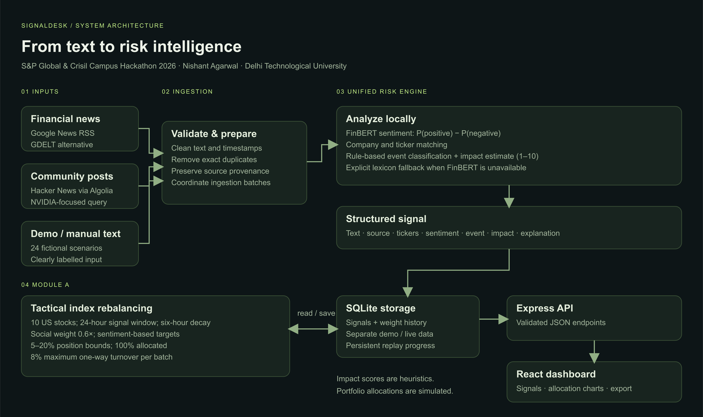

# GoRisk — S&P Global & CRISIL Campus Hackathon

**Candidate Name:** Nishant Agarwal

**College Email ID:** Pending — add before submission

**College / Campus:** Delhi Technological University

**Demo Video Link:** Pending — a public-access unlisted YouTube walkthrough is required

**Slide Deck Link:** Pending — the 5–7 slide deck has not been created yet

## 1. Project Overview / Problem Statement & Approach

Financial news and social conversations arrive as unstructured text. A risk analyst needs to identify the relevant company, understand the sentiment and event, and see how that information could affect a portfolio. GoRisk brings those steps into one explainable, Zerodha-inspired minimalist workflow.

The platform implements the unified AI/NLP Risk Engine, **Module A: Tactical Index Rebalancing**, **Module B: Strategic Portfolio Stress Testing**, and a novel **AI Predictive Market Flow Engine**. It uses local FinBERT inference for sentiment, explicit rules for event and impact estimates, and a constrained ten-stock mock index alongside a $100M wholesale banking asset book. Multi-source news (Google News, Yahoo Finance, GDELT) and community posts enter the same pipeline; a separate fictional dataset makes the demo reproducible without live feeds.

The dashboard connects each headline to its structured signal, allocation history, order flow forecast, and stress test shocks. It is a research prototype: market impact is heuristic, allocations are simulated, and no live trades are executed.

## 2. Architecture & Tech Stack



[High-resolution diagram](docs/architecture.png)

| Component   | Implementation                                            |
| ----------- | --------------------------------------------------------- |
| Interface   | React, TypeScript, Vite, Recharts, Lucide (GoStock UI)    |
| API         | Express 5 with Zod request validation                     |
| NLP         | Transformers.js, CPU inference, quantized FinBERT         |
| Market Flow | Rule & statistical AI flow engine predicting liquidity, drift & regimes |
| Persistence | Node's built-in SQLite; separate demo/live records        |
| News        | Google News RSS, Yahoo Finance Live RSS, GDELT adapter    |
| Social      | Hacker News community-submitted story titles, via Algolia |
| Testing     | Vitest, Supertest, optional real-model smoke test         |

### Risk signal

Each signal contains:

- `sentiment`: −1 to +1, calculated as **P(positive) − P(negative)**.
- `sentimentLabel`: positive above +0.15; negative below −0.15; neutral otherwise.
- `event`: Geopolitical, Macroeconomic, Credit Event, Merger/Acquisition, Product Launch, Earnings, Regulatory, Operational, or General.
- `impact`: integer from 1 to 10.
- Company tickers, original text, source type/name/URL, publication and processing timestamps, sample flag, model name, probabilities, confidence, and explanation.

The model is [`Xenova/finbert`](https://huggingface.co/Xenova/finbert), an ONNX conversion of [`ProsusAI/finbert`](https://huggingface.co/ProsusAI/finbert), pinned to revision `8f269abebfdd9009d7d9b5e96af7e5c6bfe50b20`. The application downloads model files at runtime; model weights are not committed or relicensed by this project.

**Event and impact estimation are transparent rules, not trained market-impact models.** The first matching event rule wins in this order: credit, geopolitical, regulatory, macroeconomic, M&A, earnings, product, operational, general.

```text
impact = clamp(round(event_base + 2 × |sentiment| + severity_bonus − uncertainty_penalty), 1, 10)
```

Event bases: credit 7; geopolitical 6; regulatory/macro/M&A 5; operational 4; earnings/product 3; general 2. Severe terms add 2, uncertainty terms subtract 1. The signal explanation includes the terms and arithmetic. Model confidence is the highest sentiment-class probability, not a probability of a stock-price move.

### Module A: allocation policy

The index contains 20 prominent S&P 100 constituents: AAPL, MSFT, NVDA, AMZN, GOOGL, META, TSLA, JPM, XOM, JNJ, V, WMT, PG, MA, HD, UNH, BAC, LLY, AVGO, and COST, initially at 5% each.

1. Use company-matched signals published within the last 24 hours; ignore future timestamps.
2. Apply exponential decay with a six-hour half-life. Social posts receive a 0.6 multiplier; news and manual text receive 1.0.
3. Compute each company's weighted mean sentiment `s` and raw target `0.05 × (1 + 0.8 × s)`.
4. Normalize targets onto a portfolio totalling 100%, with **2% minimum and 15% maximum** per stock.
5. Limit one-way turnover, `0.5 × sum(abs(new − old))`, to **8% per batch** by interpolating from the previous portfolio.
6. Persist a snapshot only when a batch adds a new, recent company signal. Exact duplicate text cannot repeatedly rebalance the portfolio.

Positive sentiment raises the raw target; negative sentiment lowers it. Normalization, position bounds, previous weights, and signals about other companies also influence the final change. `pp` in the table means **percentage points**, not a stock return.

## 3. Dataset Used

- **Synthetic demo:** [`data/demo.json`](data/demo.json) contains all 24 built-in scenarios: 17 news-style headlines and 7 social-style posts. The application reads this JSON file directly. These are original fictional inputs created with AI assistance, not historical news or actual posts.
- **Provenance:** [`data/sources.json`](data/sources.json) records provider URLs, query coverage, access assumptions, and the pinned model. Each demo record contains an ID, text, and source type; simulation timestamps are assigned at runtime.
- **Live news:** Google News RSS by default; GDELT is available as an alternative.
- **Live social data:** Hacker News story titles through Algolia. The initial query focuses on NVIDIA and does not represent all companies equally.
- **Portfolio:** Ten synthetic positions use real public company names. Starting weights are 10% each; no real account, customer, transaction, or confidential client data is used.

All static inputs needed for the default demo are included. Dynamic live responses are fetched on demand and can be exported from the dashboard for a particular run. No model training or fine-tuning is performed. FinBERT weights download separately and retain their upstream license; generated scores are not ground-truth labels.

## 4. Quickstart & Installation

**Runtime:** Node.js 22.13+ and npm. Tested locally on macOS with Node 24; automated checks run on Ubuntu with Node 22.

Requires **Node.js 22.13 or newer** and npm. Node 24 is also supported.

```sh
git clone https://github.com/agnishant14/DelhiTechnologicalUniversity-NishantAgarwal-Hackathon.git
cd DelhiTechnologicalUniversity-NishantAgarwal-Hackathon
npm ci
npm run dev
```

Open **http://localhost:5173**. The API runs at http://localhost:3001.

On the first run, FinBERT downloads its quantized model from Hugging Face. Allow a few minutes and keep an internet connection available. Subsequent starts use the local cache. No API key or paid service is required.

For a production build served by one local process:

```sh
npm run build
npm start
```

Open **http://localhost:3001**. Keep that terminal running while using the app. The server binds to the local machine by default; this repository is not a hosted website.

### Demo walkthrough

1. Start in **Demo workspace**: 12 fictional news and social scenarios are analyzed through the actual engine.
2. Select **Run next event** to process two more scenarios and update allocation history. There are 24 scenarios in total.
3. Open any headline to inspect sentiment probabilities, event cues, impact calculation, provenance, and JSON.
4. Use **Analyze text** to submit your own headline. It is labelled manual input and saved to the current workspace.
5. Open **Signal explorer** to search and filter, or **Index portfolio** to compare weights and their latest changes.
6. Select **Connect live sources**, then **Fetch live sources**. This switches to a separate dataset and portfolio. Demo records never appear as live headlines.
7. Use **Export data** to download signals, holdings, history, and source status as JSON.

Original synthetic scenarios are in [`data/demo.json`](data/demo.json). They are not historical news or claims about the named companies. Replaying stops after the final scenario; manual analysis remains available. Data persists across restarts. For a fresh, separate demo, launch with a new `DATABASE_PATH` rather than deleting your existing database.

### Configuration and live feeds

Copy `.env.example` to `.env` for optional configuration. Existing environment variables take precedence.

| Variable        | Default                  | Purpose                                                           |
| --------------- | ------------------------ | ----------------------------------------------------------------- |
| `PORT`          | `3001`                   | Server port; keep 3001 when using the default Vite proxy          |
| `HOST`          | `127.0.0.1`              | Bind address                                                      |
| `DATABASE_PATH` | `data/signaldesk.sqlite` | Persistent local database                                         |
| `NEWS_SOURCE`   | `rss`                    | Set to `gdelt` to use GDELT instead of Google News                |
| `NLP_MODEL`     | `finbert`                | Set to `lexicon` for the explicitly labelled lightweight fallback |

**Live ingestion:** up to 20 news items and 20 Hacker News items per refresh. The news query covers selected index companies and financial terms; the social query currently focuses on NVIDIA. This is a small demonstration sample, not comprehensive market coverage. Sources are fetched independently with timeouts, so a failed feed does not prevent the other from being analyzed. Source errors and last-fetch times are shown in the dashboard. Refreshes run every five minutes while the server is in live mode; manual refreshes have a one-minute cooldown.

Google News and Hacker News ingest titles, not full article bodies. GDELT uses its `seendate` observation time because the article-list endpoint does not provide a separate publication timestamp. External feeds may be delayed, empty, or unavailable. This is polling-based monitoring, not exchange-grade high-frequency infrastructure.

The local cache and database are ignored by Git. No credentials are needed for the bundled sources. No Kaggle data or financial transaction records were supplied, so the repository does not claim to use them. Yahoo Finance prices are not required for the allocation-only demonstration; no market prices or returns are fabricated.

If FinBERT cannot load, the app shows **Lexicon fallback**, and every affected signal records that model. Its confidence is `null`. It is a basic negation-aware lexicon and should not be treated as equivalent to FinBERT. Set `NLP_MODEL=lexicon` for a fast first run without model downloads. The interface has system font fallbacks when Google Fonts is unavailable.

### API

All paths are under `/api`. Error responses are JSON. The local API is intended for one research workspace, without user accounts or authentication.

| Method | Route          | Result                                                            |
| ------ | -------------- | ----------------------------------------------------------------- |
| GET    | `/health`      | Startup state and model status                                    |
| GET    | `/dashboard`   | Signals, metrics, holdings, history, sources, flow & replay info  |
| GET    | `/signals`     | Signals in the active workspace                                   |
| GET    | `/market-flow` | AI Market flow prediction matrix, regime forecast & drift deltas  |
| GET    | `/export`      | JSON download of the active workspace                             |
| POST   | `/analyze`     | Analyze and persist a document; rebalance if eligible             |
| POST   | `/replay`      | Analyze the next two demo scenarios                               |
| POST   | `/mode`        | Switch with `{"mode":"demo"}` or `{"mode":"live"}`                |
| POST   | `/refresh`     | Fetch live sources and analyze new documents                      |

```sh
curl http://localhost:3001/api/analyze \
  -H 'Content-Type: application/json' \
  -d '{"text":"Apple reports record profits and beats revenue forecasts."}'
```

`text` is required (10–6000 trimmed characters). Optional fields are `sourceKind` (`news`, `social`, or `manual`), `sourceName`, HTTP(S) `sourceUrl`, and ISO `publishedAt`. Manual input and the current time are the defaults. The server sets the workspace and sample flag; clients cannot mark live records as demo fixtures. Responses have `{ added, signals }`; duplicates return an empty array. Requests made during startup return 503; overlapping updates return 409; refresh cooldown returns 429.

### Validation

```sh
npm test
npm run build
npm run test:model
```

The main tests use deterministic model outputs and do not require downloads. They cover signal structure, entity matching, fallback negation, event rules, input validation, duplicate handling, dataset isolation, partial feed failures, replay persistence, and portfolio normalization/bounds/turnover over repeated extreme events.

The optional model smoke test runs actual FinBERT on three synthetic positive/negative/neutral examples. **This is not an accuracy benchmark or backtest.** GitHub Actions runs tests and the production build on each push.

### Project map

```text
server/engine.ts       Sentiment, company matching, event and impact rules
server/flow.ts         Predictive market flow engine and regime forecast
server/sources.ts      Live news and social adapters (Google, Yahoo, GDELT, HN)
server/service.ts      Ingestion, deduplication, replay, and refresh coordination
server/portfolio.ts    Sentiment aggregation and allocation constraints
server/store.ts        SQLite persistence
server/app.ts          HTTP routes and validation errors
shared/types.ts        Signal contracts and index universe
src/App.tsx            Interactive GoStock dashboard, stress test & flow matrix
src/styles.css        GoStock minimalist theme, cards, and responsive layouts
tests/                Engine, portfolio, source, and API checks
scripts/check-model.ts Real-model smoke test
```

## 5. Key Results & Domain Impact

- Produces source-linked sentiment, event classification, and impact estimates from news and social-style text.
- Demonstrates allocation changes across ten stocks with weights totalling 100%, 5–20% position bounds, and an 8% turnover cap per batch.
- Exact duplicate input produces no additional inference or rebalance. This avoids repeating work compared with reprocessing every fetched headline.
- **20 automated tests pass**, including source parsing, input validation, persistence, duplicate handling, update coordination, and portfolio constraints. GitHub Actions runs tests and the build on every push.
- Three actual-FinBERT smoke checks returned positive **+0.719**, negative **−0.912**, and neutral **−0.036** sentiment for synthetic examples. These are sanity checks, not an accuracy benchmark.
- Public news and community feeds were exercised end to end. Network timing and feed contents vary; no latency, accuracy improvement, return, or cost-saving percentage is claimed.

For an analyst, the practical benefit is a traceable route from incoming text to risk triage and portfolio scenario exploration. The interface shows the original input, scoring rationale, and allocation changes together, making assumptions easier to challenge during review.

### Limitations

- Implements the core engine, **Module A (Tactical Index Rebalancer)**, and **Module B (Strategic Wholesale Banking Stress Testing)** alongside the AI Market Flow Predictor.
- Uses a real pretrained sentiment model; event classification and impact remain documented heuristics without external calibration.
- Entity matching uses names and aliases, which can be ambiguous. Multiple companies in one document receive the same sentiment; attribution is not entity-specific.
- English text only; sentiment input truncates at 512 tokens. Sarcasm, negation, competing events, manipulated posts, and domain shifts can produce incorrect scores.
- Signals are stored for review; allocation calculations only consider recent signals. Dashboard sentiment summarizes all stored signals in the selected workspace, not a market-wide sentiment index.
- No execution, price feed, transaction costs, liquidity model, return prediction, or financial-performance claim. This is a hackathon research prototype with a simulated portfolio.

### AI assistance and attribution

AI assistance was used to develop the implementation, synthetic scenarios, documentation, and diagram. The project uses the third-party FinBERT model and open-source libraries listed above; it does not claim to have trained a new model. The candidate should review the implementation and be prepared to explain its assumptions in the jury session.

### License and submission status

Original code and synthetic scenarios are available under the [MIT license](LICENSE). External model weights and live content retain their upstream terms.

The public code repository, architecture diagram, and synthetic dataset are available. The college email, presentation deck, and YouTube walkthrough still need to be completed before the official submission.
